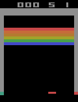

# fdl-atari
<h3 align="center">
  
</h3>

## Purpose:

The goal is to implement a DQN model with experience replay model taken from the paper <a href="https://www.cs.toronto.edu/~vmnih/docs/dqn.pdf">Playing Atari with Deep Reinforcement Learning</a> on the Breakout game.
<h3 align="center">

</h3>

## How to start:
1. Clone the repo.
2. Go to the root folder
3. Install required packages `pip install -r requirements.txt` or `pip install -r requirements_gpu.txt` if you want to use tensorflow-gpu.
4. Run the following script with the option --help to see all availablee options. `python3 main.py --help`
